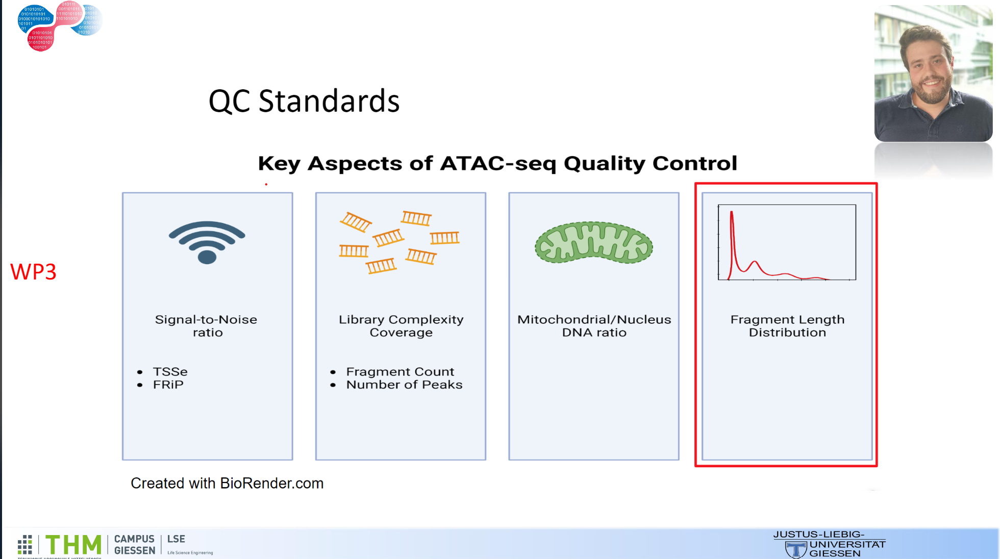
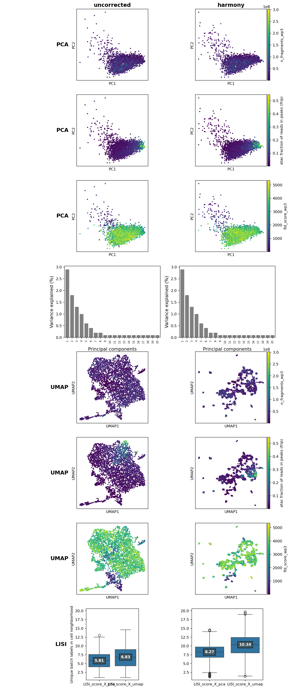

# Work Package 3 - PeakQC

This work package focuses on a quality control software called PeakQC, developed by Detleffsen et al. (2025)[^1]. The authors tested and verfied the software on single-cell ATAC-seq data. PeakQC uses the Fragment Length Distribution (FLD) as a quality measure. In ATAC-seq data, the FLD typically shows a characteristic periodic pattern: a peak at approximately 42 base pairs (bp) for open chromatin, as well as peaks at ~200 bp for mononucleosomes and ~360 bp for dinucleosomes. PeakQC uses a wavelet-based scoring method to recognize and quantify this periodic pattern in often noisy single-cell data. The higher the score, the better the respective sample is.

The authors compare PeakQC with other quality metrics such as the fragment ratio calculation (mNSC), the ratio of fragments in peaks (FRiP), the transcription start site enrichment (TSSe), and the total count of fragments (TC). PeakQC stands out through:

1. A linear quality scale that correlates well with the periodic pattern of the FLD
2. Filtering of low-quality cells while preserving biologically relevant data

The authors show that PeakQC works particularly well when combined with other QC metrics such as FRiP or TC. According to the paper, the best results were achieved using a combination of the PeakQC score,  FRiP, and TC.

The authors suggest establishing the FLD pattern as a new standard for quality assessment of ATAC-seq data. The task of this project is to examine to what extent PeakQC can also be used for bulk data, such as the NAPKON dataset.

Since PeakQC serves as quality control and the application in this project is experimental, there is an interface to WP1. WP3 receives prepared data from the SC-Framework[^2], specifically an AnnData object, to which the FLD scoring and other descriptive measures such as the number of fragments per sample and the mean fragment length are added. This augmented data is returned to WP1. The FLD scoring is used in the further downstream analysis of WP1.

## The PeakQC Pipeline
### Fragmentation of the BED Files
Given are 3507 BAM files containing the sequencing results of the bulk ATAC analysis of the NAPKON experiment. The files are 1-11GB in size. A barcode is added to these files from the filename and they are subsequently fragmented using the sinto software[^3]. The individual fragment files were combined into one large file. (If the PeakQC pipeline were modified, this last step could be omitted to save storage space and time.)

This step took several days. The pipeline for performing the corresponding analysis can be found in the folder 'wp3_code/bam_sinto_bed'.

The pipeline is a mixture of shell script and Python functions. This was later completely translated into Python.

### Application and Revision of PeakQC

The fragmented BAM files are then summarized with the PeakQC software for each sample as follows:
- The fragment length distribution is created.
- The number of fragments per sample is determined.
- The average fragment length is calculated.
The summary is stored in a count table.

Due to the file size (total ~3TB), the existing PeakQC pipeline could not be used as it was optimized for SC and the memory of the VMs used was insufficient. Therefore, a modified pipeline was created. The main difference is that DuckDB[^4] with a memory limit was used to create the count table. This pipeline could create the count table (much faster).

The previous pipeline was implemented together with this step in the function 'wp3_code/PeakQC/PeakQC/bam_sinto_bed_into_count_table.py'.

In the PeakQC pipeline, the add_fld_metrics function was adapted to use the count table and to be able to run the function often for experiments without starting from the BAM files each time, as provided by the PeakQC pipeline.

The PeakQC pipeline creates various plots of the data. An important plot is the density plot of the number of fragment lengths per sample. This could not be created for the bulk data because the implementation was too memory-intensive for the high numbers of fragment lengths per sample. In addition, the plots was not very informative due to the extreme outliers the data inherits.

The following descriptive statistics illustrate the problem well: The range is enormous and the distribution highly asymmetric. For example, the 99th percentile is 99 and the 99.99 percentile is 892,461, and the 100th percentile. The 50% percentile is at 1786. These enormous outliers are attributable to relatively few samples (~33) and usually come from short fragment lengths of less than 30bp.

Descriptive statistics of the fragment length distributions:
- Mean: 19,670.0
- Median: 1,786.0
- Standard deviation: 51,351.0
- Range: [0, 2,644,214]
- Zero values: 64,776 (1.8%)
- Non-zero values: 3,445,731 (98.2%)
- Distribution: (3,507 x 1,001)

Descriptive statistics of the total number of fragments (per sample):
- Mean: 21,216,737.18
- Median: 19,173,886.00
- Standard Deviation: 14,667,782.56
- Minimum: 175.00
- Maximum: 302,511,076.00
- 25th Percentile: 11,427,027.50
- 75th Percentile: 28,082,692.50
- 95th Percentile: 45,994,319.50
- 99th Percentile: 67,249,932.12
- 99.99th Percentile: 242,744,219.32

The pipeline was adjusted accordingly. In addition, attempts were made to censor the extremes in the upper percentiles. This achieved relative computational efficiency but still no meaningful density plots. Therefore, a Monte Carlo multinomial downsampling was used: All samples with a number of fragments higher than 10,000 are downsampled to exactly these 10,000 observations. The relative frequencies of the number of fragment lengths in the fragment length distribution are taken as probabilities from which M (= 100) different distributions are drawn and the mean per sample is calculated.

This makes the plotting meaningful and efficient. Moreover, it somewhat breaks the positive correlation between the number of fragments and the height of the FLD score, if the sample_size is chosen small enough. A sample_size of 10,000 was chosen as this regularly corresponds to the number of fragments in the SC. This is below the median of about 20,000.

The following figure shows the density plot. The following figure shows the density plot. The density plot depicts the expected periodic pattern of the fragment length distribution, with distinct peaks indicating nucleosome-free regions, mononucleosomes, and dinucleosomes.

The distribution of FLD scores is shown in the next plot. This distribution looks very similar to the shape of score for sc-ATAC seq data.

It is important to emphasize that the FLD scores cannot be compared between different samples. This limitation is somewhat mitigated by downsampling.

Not yet production-ready, as it is currently still too memory-intensive, is the plotting function of the percentiles of the FLD scores. This could look like the following and help WP1 in selecting the threshold values to filter samples with low quality. The multi density plot shows that the expected pattern becomes more distinct for higher FLD scores. Additionally, the plots underline the metrics ability to differeniciate between samples of low and and good qualitity.

In addition, a scatter plot and the following statistics were provided to make threshold selection easier for WP1.

FLD-Score Percentiles:
- 10th percentile: 1877.701918
- 20th percentile: 2675.414017
- 30th percentile: 3014.333702
- 40th percentile: 3271.472162
- 50th percentile: 3480.659065
- 60th percentile: 3647.739243
- 70th percentile: 3812.890100
- 80th percentile: 3994.103388
- 90th percentile: 4235.033384
- 100th percentile: 5341.552203

The calculated FLD scores and other metrics and graphics were made available to WP1.

### Further Suggested Changes for the PeakQC Pipeline
- Conversion of the number of fragment length distributions to relative frequencies:
    This could be implemented and applied if the range of fragment length counts for BP from 1...1000 is not too large. Similar to downsampling, this breaks the correlation between the number of fragment lengths - but is calculated much faster.
- Removing the Peak Threshold:
    The peak threshold selection would theoretically have to be selected individually for each sample and would ultimately usually only exclude the last peaks >360bp from the scoring. These hardly matter anyway. (This was verified by calculating the weights only for the first three peaks.)
- Memory-friendly implementation of the percentile-wise representation of fragment length distributions:
    This plot could help with threshold selection and offer further insights, thus being helpful in application, as threshold selection tends to be more qualitative.
- No aggregation of fragment files into a common BAM file for large datasets:
    Counter-proposals include omitting this step or creating a DuckDB database when combining the data into a count table (suggestions for this can be found in PeakQC.insertsize.py or bam_sinto_bed_into_count_table.py)

## Comparison of FLD Scoring with Other Metrics
WP1 generated the following PCAs and UMAPs for us. In addition, Cohen's Kappa was calculated to see how differently the KO criteria of the various metrics affect the data and filtering process.

First, the respective metrics are briefly explained.

The **PeakQC Score** (fld_score_wp3) evaluates the periodicity of the fragment length distribution (FLD). According to Detleffsen et al. (2025), "PeakQC utilizes a wavelet based convolution of the FLD to denoise the signal which can subsequently be validated based on the expected periodical pattern."[^1] A high PeakQC value indicates that the Tn5 transposase has optimally bound to accessible chromatin regions, creating the characteristic pattern of fragment lengths attributable to mono-, di-, and tri-nucleosomes. This metric was originally developed for SC-ATAC-seq and is particularly reliable in this context as an indicator of the technical quality of the ATAC-seq library but seems to work well for Bulk ATAC-seq data too.

The **Fragment Count** (n_fragments_wp3) indicates the total number of unique DNA fragments in the sample. As noted in the paper, "library complexity, determined by total number of unique fragments"[^1] is one of the standard quality control aspects. Sufficient fragment count is fundamental for representative genome coverage and directly influences the sensitivity of the analysis.

The **Mean Fragment Size** (mean_fragment_size_wp3) provides information about the average length of the sequenced fragments. Extreme deviations may indicate DNA degradation, excessive PCR amplification, or other technical problems.

The **Fraction of Reads in Peaks** (atac fraction of reads in peaks, FRiP) measures the proportion of sequencing reads that fall within identified peaks. According to the PeakQC paper, this is part of "enrichment of open chromatin signals at certain regions/peaks visible in the signal to noise ratio"[^1]. This metric is an important indicator of the signal-to-noise ratio: a high FRiP value indicates specific binding of the Tn5 transposase to accessible chromatin.

The **Fold Change Promoters Fragments** metric evaluates the enrichment of fragments in promoter regions compared to the background. It provides insight into the biological relevance of the captured signals, as promoters typically represent accessible chromatin regions.

The following tables show how many samples pass each filter.

| Metric | Passing Cells | Percentage | Threshold |
|--------|---------------|------------|-----------|
| mean_fragment_size_wp3 | 3,503 | 99.89% | 50 - 290 |
| n_fragments_wp3 | 3,280 | 93.53% | 3,000,000 - 60,000,000 |
| fold_change_promoters_fragments | 3,277 | 93.44% | 0.03 - 0.12 |
| atac fraction of reads in peaks (frip) | 2,884 | 82.24% | 0.0125 - 0.15 |
| fld_score_wp3 | 2,795 | 79.70% | 2,675 - 4,900 |

| Combined Metrics | Passing Cells | Percentage |
|------------------|---------------|------------|
| Fragment Count + FRiP | 2,697 | 77.00% |
| PeakQC + FRiP | 2,422 | 69.00% |
| PeakQC + Fragment Count + FRiP | 2,353 | 67.00% |

| Multiple Metrics | Passing Cells | Percentage |
|------------------|---------------|------------|
| Passing all 5 metrics | 2,292 | 65.00% |
| Passing at least 4 metrics | 3,014 | 86.00% |
| Passing at least 3 metrics | 3,422 | 98.00% |

### Cohen's Kappa:
To investigate the filtering effects of the different metrics, the samples were filtered based on the thresholds determined by WP1, and the binary classification "filtered vs. not filtered" was compared using Cohen's Kappa.

The calculated Cohen's Kappa values show the degree of agreement between different binary classified metrics, taking into account chance. Higher Kappa values (> 0.2) indicate moderate agreement[^5], e.g., between "atac fraction of reads in peaks (frip)" and "fold_change_promoters_fragments" (0.314). This suggests that these two metrics have similar filtering effects. This also applies to "fld_score_wp3" and "n_fragments_wp3". That is, the downsampling has not completely removed the relationship between the two metrics.

Low or near-zero values indicate low or random agreement. For example, the combination "fld_score_wp3" and "mean_fragment_size_wp3" with 0.009 shows hardly any correlation. Negative values (e.g., "n_fragments_wp3" and "fold_change_promoters_fragments": -0.056) may indicate a slight tendency toward opposite classification.

The analysis of the 3,507 samples in this bulk ATAC-seq dataset shows interesting patterns in the quality distribution. First, it is noticeable that the mean fragment size with 99.89% is the least selective metric – almost all samples fall within the defined range of 50-290 base pairs. This suggests that fragmentation during library preparation was consistent and there were few qualitative differences between samples.

The fragment count and fold change promoters metrics show similar pass rates of about 93%, indicating good general coverage and enrichment in regulatory regions. The FRiP value with 82.24% and the PeakQC score with 79.70% of the samples are somewhat more selective. These metrics specifically filter out samples with poor signal-to-noise ratio or indistinct nucleosomal patterns.

Remarkably, 65% of all samples meet all five quality criteria. 98% of the samples pass at least three metrics, while only three samples meet just one criterion.

The combination of multiple metrics enhances quality filtering. The combination of fragment count and FRiP retains 77% of the samples, while PeakQC and FRiP together select 69%. The strictest filter combination – PeakQC, fragment count, and FRiP – leads to the most selective choice at 67%.

## Suitability of the PeakQC Score for Bulk ATAC-seq

The PeakQC score, originally conceived for the quality assessment of SC-ATAC-seq data and adapted for bulk data analysis, shows particularly high suitability for the present bulk dataset. In bulk ATAC-seq, the nucleosomal patterns in the fragment length distribution are typically more pronounced than in single-cell analyses, as the data comes from a larger cell population and is not affected by the sparsity of individual cells.

The results confirm this expectation: With a selective pass rate of 79.70%, the PeakQC score effectively identifies samples with clear periodic patterns in the fragment length distribution, indicating optimal Tn5 transposase activity. The moderate agreement with other established quality metrics such as FRiP (κ=0.2283) and fragment count (κ=0.2005) further emphasizes that the PeakQC score captures complementary quality aspects that are not fully covered by other metrics.

The combination of the PeakQC score with the FRiP value proves particularly effective. This combination unites the assessment of fragment length periodicity with the signal-to-noise ratio, thus providing comprehensive quality control that considers both technical and biological aspects of the ATAC-seq data. With a combined pass rate of 69%, this combination represents a good compromise between stringent quality filtering and sufficient data retention.

The high effectiveness of the PeakQC score in this bulk dataset confirms that this metric maintains its original strength in the analysis of bulk ATAC-seq data and makes a valuable contribution to quality control. In the context of bulk analyses, the PeakQC score benefits from the more robust signals and more distinct nucleosomal patterns, leading to reliable identification of high-quality samples.

Overall, the results show that the PeakQC score, in combination with other quality metrics, is an effective tool for comprehensive quality assessment of bulk ATAC-seq data and contributes to the identification of high-quality datasets for subsequent analyses. This would confirm the conclusion about the good suitability of PeakQC from [11] also for bulk data.

Below is another figure with PCA and UMAP representations of the data:

The visualization of the ATAC-seq data shows the different influence of the three central quality metrics on the data structure (selected based on the aforementioned assesment). The fragment count (n_fragments_wp3), shown in the first row, displays a relatively homogeneous distribution with uniformly violet coloration and only a few lighter outliers. This low level of structuring corresponds to the high pass rate of 93.53% and suggests that this metric primarily captures technical quality aspects that correlate little with biological variability.

The FRiP value (Fraction of Reads in Peaks) in the second row already shows a more distinct pattern. The enrichment of higher values in the right area of the PCA plots and local clusters in the UMAP representations show that the FRiP value correlates with both technical and biological factors. This more heterogeneous distribution corresponds to the medium selectivity of the FRiP value with a pass rate of 82.24%.

The structuring is most pronounced for the FLD score (PeakQC) in the third row. The strong color variance from dark blue to light green/yellow and the clear correlation with both principal components underline the high biological relevance of this metric. In the UMAP representation, clear clusters structured according to FLD score form, which become even more distinct after Harmony correction. This might explain why the FLD score at 79.70% is the most selective single metric.

Particularly insightful is the comparison between uncorrected and harmonized data. While the Harmony correction hardly changes the fragment count distribution, it significantly enhances the separation of the FLD score-based clusters. This confirms that the FLD score captures biologically relevant signals that become more visible through the removal of technical variations. The higher LISI scores in the harmonized data also underline the successful integration through the Harmony correction.

The visualization thus confirms the results of the statistical analysis: The three metrics capture complementary quality aspects with different biological relevance. This explains why combinations of these metrics, especially PeakQC + FRiP, are particularly effective for comprehensive quality filtering that considers both technical and biological aspects.

However, the selection and application of the metrics for cluster formation are addressed more by WP1.

[^1]: https://www.biorxiv.org/lookup/doi/10.1101/2025.02.20.639146
[^2]: https://github.com/loosolab/SC-Framework
[^3]: https://timoast.github.io/sinto/basic_usage.html
[^4]: https://duckdb.org/docs/stable/clients/python/overview.html
[^5]: https://doi.org/10.2307/2529310