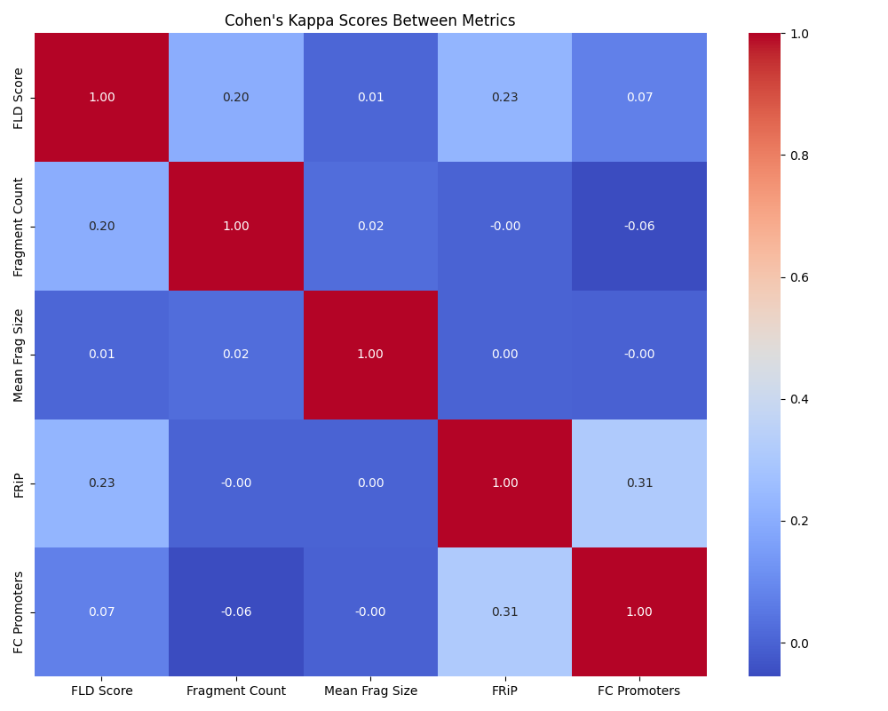

# Workpackage 3 - PeakQC
Dieses Workpackage befasst sich mit einer Qualitätkontrollsoftware, namentlich PeakQC, die von Detleffsen et al. (2025)[^1] entwicklet wurde. Die Autoren haben die Software in dem benannten Paper auf Singlecell-ATAC-seq-Daten (scATAC-seq) getestet. ATAC-seq ist eine Methode zur Identifizierung regulatorischer Regionen im Genom durch Analyse der Chromatin-Zugänglichkeit.

PeakQC nutzt die Fragmentlängenverteilung (FLD) als Qualitätsmaß. Bei ATAC-seq-Daten zeigt die FLD typischerweise ein charakteristisches periodisches Muster: einen Peak bei etwa 42 Basenpaaren (bp) für offenes Chromatin, sowie Peaks bei ~200 bp für Mononukleosomen und ~360 bp für Dinukleosomen. PeakQC verwendet ein Wavelet-basiertes Scoring, um dieses periodische Muster in den oft verrauschten Einzelzelldaten zu erkennen und zu quantifizieren.

Die Autoren vergleichen PeakQC mit anderen Qualitätsmetriken wie der Fragmentverhältnis-Berechnung (mNSC), dem Verhältnis von Fragmenten in Peaks (FRiP), der Transkriptionsstartstellen-Anreicherung (TSSe) und der Gesamtzahl der Fragmente (TC). PeakQC zeichnet sich aus durch

1. eine lineare Qualitätsskala, die gut mit dem periodischen Muster der FLD korreliert
2. Filterung Zellen niedriger Qualität, während es biologisch relevante Daten bewahrt

Die Autoren zeigen, dass PeakQC besonders gut funktioniert, wenn es mit anderen QC Metriken wie FRiP oder TC kombiniert wird. Die besten Ergebnisse wurden mit einer Kombination aus PeakQC-Score, FRiP und TC erzielt.

Die Autoren schlagen vor, das FLD-Muster als neuen Standard für die Qualitätsbewertung von ATAC-seq-Daten zu etablieren. Aufgabe dieses Projektes ist zu schauen, inwieweit sich PeakQC auch für Bulk-Daten, wie dem NAPKON Datensatz verwenden lässt.

Da PeakQC somit der Qualtitäskontrolle dient und die Anwendung in diesem Projekt experimentell erfolgt, gibt es eine Schnittstelle zu WP1. WP3 erhält die vorbereiteten Daten aus dem SC-Framework[^2], genauer gesagt ein anndata Objekt, dem das FLD-Scoring und weitere deskriptive Maße wie die Anzahl an Fragmenten pro Sample und die durchschnittliche Fragmentlänge beigefügt werden. Diese ergänzten Daten erhält WP1 zurück. Das FLD-Scoring wird in der weiteren Downstreamanalyse von WP1 verwendet.

## Die PeakQC Pipeline
### Fragmentierung der BED Dateien
Gegeben sind 3507 BAM Dateien, die die Sequenzierergebnisse der Bulk-ATAC Analyse des NAPKON Experiments enthalten. Die Dateien sind 1-11GB groß. Diesen Dateien wird aus dem Dateinamen ein Barcode hinzugefügt und diese anschließend mit der Software sinto[^3] fragementiert. Die einzelnen Fragmentdateien wurden zu einer großen Datei zusammengefügt. (Bei Modifikation der PeakQC-Pipeline könnte auf den leztzen Schritt verzichtet werden, um Speicherplatz und Zeit zu sparen.)

Dieser Schritt dauerte mehrere Tage. Im Ordner 'wp3_code/bam_sinto_bed' findet sich die Pipeline um die entsprechende Analyse durchzuführen.

Die Pipeline ist eine Mischung aus Shell-Script und Python Funktionen. Diese wurde später komplett in Python übersetzt.

### Anwendung und Überarbeitung von PeakQC

 Die fragmentierte BAM Dateien, werden anschließen mit der PeakQC Software für jedes Sample wie folgt zusammengefasst:
- Es wird die Fragmentlängenverteilung erstellt.
- Die Anzahl der Fragmente pro Sample bestimmt.
- Die durchschnittliche Fragmentlänge berechnet.
Die Zusammenfassung befindet sich in einem Count-Table.

Aufgrund der Dateigröße (insgesamt ~ 3TB) konnte die bestehende PeakQC-Pipeline jedoch nicht verwendet werden, da diese für SC optimiert wurde und der Arbeitsspeicher der verwendeten VMs nicht ausreichte. Deshalb wurde eine modifizierte Pipeline erstellt. Der Hauptunterschied ist, dass DuckDB[^4] mit einem Memorylimit verwendet wurde, um den Counttable zu erstellen. Diese Pipeline konnte den Count-Table (deutlich schneller) erstellen.

Die vorherige Pipeline wurde zusammen mit diesem Schritt in der Funktion 'wp3_code/peakqc/peakqc/bam_sinto_bed_into_count_table.py' implementiert.

In der PeakQC-Pipeline wurde die add_fld_metrics Funktion angepasst, um den Count-Table verwenden zu können und die Funktion für Experimente oft laufen lassen zu können, ohne jedesmal von den BAM Files auszustarten, wie es die PeakQC-Pipeline vorsieht.

Die PeakQC-Pipeline erstellt verschiedene Plots zu den Daten. Ein wichtiger Plot ist der DensityPlot der Anzahl der Fragmentlängen pro Sample. Dieser konnte für die Bulk-Daten nicht erstellt werden, da die Implementation zu Arbeitspeicherintensiv war für die hohen Anzahlen an Fragmentlängen pro Sample. 

Die nachsthehende beschreibende Statistik zeigt das Problem ganz gut auf: Die Range ist enorm und die Verteilung stark asymetrisch. So beträgt zum Beispiel das 99 Perzentile, 99 und das 99.99 Percentile 892,461 und das 100 Perzentile. Das 50% Perzentile liegt bei 1786. Diese enormen sind Ausreißer sind auf relativ wenige Samples (~33) zurückzuführen und stammen in der Regel von kurzen Fragmentlängen von kleiner 30bp.

Deskriptive Statistik der Fragmentlängenverteilungen:
- Mean: 19,670.0
- Median: 1,786.0
- Standard deviation: 51,351.0
- Range: [0, 2,644,214]
- Zero values: 64,776 (1.8%)
- Non-zero values: 3,445,731 (98.2%)
- Distribution: (3,507 x 1,001)

Deskriptive Statistik der Gesamtzahl an Fragmenten (pro Sample):
- Mean: 21,216,737.18
- Median: 19,173,886.00
- Standard Deviation: 14,667,782.56
- Minimum: 175.00
- Maximum: 302,511,076.00
- 25th Percentile: 11,427,027.50
- 75th Percentile: 28,082,692.50
- 95th Percentile: 45,994,319.50
- 99th Percentile: 67,249,932.12
- 99.99th Percentile: 242,744,219.32

Die Pipeline wurde entsprechend angepasst. Außerdem wurde versucht, die Extreme in den oberen Percentilen zu zensieren. Dies erwirkte relative recheneffizienz, jedoch noch keine aussagekräftigen Dichteplots. Deshalb wurde auf ein Monte Carlo Multinomial Downsampling zurückgeriffen: Alle Samples mit einer Anzahl an Fragmenten höher als 10.000 werden auf eben diese 10.000 Beobachtungen heruntergesampled. Die relativen Häufigkeiten der Anzahl der Fragmentenlängen in der Fragmentlängenverteilung werden dabei als Wahrscheinlichkeiten genommen von der M (= 100) verschiedene Verteilungen gezogen und der Mittelwert pro Sample berechnet.

Dies macht das Plotting aussagekräftig und effizient. Außerdem wird damit die positive Korrelation zwischen Anzahl an Fragmenten und höhe des FLD-Scores etwas aufgebrochen, wenn die sample_size kleingenug gewählt wird. Es wurde eine sample_size von 10,000 gewählt, da dies regelmäßig der Anzahl an Fragmenten im SC entspricht. Diese liegt unter dem Median von etwa 20,000.

Die nachstehende Abbildung zeigt den Densityplot.

Außerdem ist die Verteilung der FLD-Scores gezeigt:

Es ist wichtig zu betonen, dass die FLD-Scores nicht zwischen den verschiedenen Samples verglichen werden kann. Diese Limitation wird etwas durch das Downsampling etwas aufgebrochen.

Nicht produktionsreif, da derzeit noch zu arbeitsspeicherintensiv ist die Plottingfunktion der Perzentile der FLD-Scores. Das könnte dann so aussehen und bei der Auswahl eines Schwellenwertes für WP1 helfen:

Außerdem wurde ein Scatterplot sowie die nachstehenden Statistiken bereitgestellt, um WP1 die Schwellenwertwahl zu erleichtern.

FLD-Score Perzentile:
- 10th percentile: 1877.701918
- 20th percentile: 2675.414017
- 30th percentile: 3014.333702
- 40th percentile: 3271.472162
- 50th percentile: 3480.659065
- 60th percentile: 3647.739243
- 70th percentile: 3812.890100
- 80th percentile: 3994.103388
- 90th percentile: 4235.033384
- 100th percentile: 5341.552203

Die ermittelten FLD-Scores sowie andere Metriken und Graphiken wurden WP1 zur Verfügung gestellt.
### Weitere Änderungsvorschläge für PeakQC Pipeline
- Umwandlung der Anzahl an Fragmentlängenverteilung in relative Häufigkeiten:
    Dies könnte implementiert werden und Anwendung finden, wenn die Range der Fragmentlängenanzahl für die BP von 1...1000 nicht zu groß ist. Dies bricht ähnlich wie das Downsampling die Korrelation zwischen Anzahl der Fragmentlängen auf - ist jedoch deutlich schneller berechnet.
- Entfernen des Peak Thresholds:
    Die Peak-Thresholdauswahl müsste theoretisch für jedes Sample individuel ausgewählt werden und würde letztendlich in der Regel nur die letzten Peaks >360bp von dem Scoring ausschließen. Diese fallen ohnehin kaum ins Gewicht. (Dies wurde überprüft indem die Gewichtungen nur für die ersten drei Peaks berechnet wurden.)
- Arbeitsspeicherfreundliche Implementation der perzentilweisen Darstellung der Fragmentlängenverteilungen:
    Dieser Plot könnte bei der Schwellenwertauswahl helfen und weitere Einblicke bieten und damit hilfreich in der Anwendung sein, da die Schwellenwertauswahl eher Qualitativ erfolgt.
- Keine Zusammenfassung der Fragment-Dateien in einem gemeinsamen BAM-File für große Datensätze:
    Gegenvorschläge umfassen das weglassen oder die Erstellung einer DuckDB-Database beim Zusammenfassen der Daten zu einem Count-Table (Vorschläge dafür finden sich in peakqc.insertsize.py oder bam_sinto_bed_into_count_table.py)

## Vergleich zwischen FLD-Scoring und anderen Metriken
WP1 war so freundlich uns die nachstehenden UMAPs zu erzeugen. Außerdem wurde Coehn's Kappa berechnet, um zu schauen, wie unterschiedlich sich die KO-Kriterien der verschiedenen Metriken auswirken.

Auf die Auswahl und Anwendung der Metriken für die Clusterbildung wird jedoch mehr von WP1 eingegangen.

[./images/ BEISPIEL]
[./images/ BEISPIEL]
[./images/ BEISPIEL]

INTERPREATION

### Cohen's Kappa:
Um die Filtereffekte der verschiedenen Metriken zu untersuchen, wurden die Samples basierend auf den - von WP2 ermittelten - Schwellenwerten gefiltert und die binäre Klassifikation "gefiltert vs. nicht gefiltert" mit Cohen's Kappa verglichen.

Die berechneten Cohen's Kappa Werte zeigen das Maß der Übereinstimmung zwischen verschiedenen binär klassifizierten Metriken unter Berücksichtigung von Zufall. Höhere Kappa-Werte (> 0.2) weisen auf eine moderate Übereinstimmung hin[^5], z. B. zwischen "atac fraction of reads in peaks (frip)" und "fold_change_promoters_fragments" (0.314). Dies deutet darauf hin, dass diese beiden Metriken ähnliche Filtereffekte haben. Dies gilt auch für "fld_score_wp3" und "n_fragments_wp3". D. h. ganz hat das Downsampling den Zusammenhang zwischen den beiden Metriken nicht aufgehoben.

Niedrige oder nahe 0 liegende Werte deuten auf eine geringe oder zufällige Übereinstimmung hin. Beispielsweise zeigt die Kombination "fld_score_wp3" und "mean_fragment_size_wp3" mit 0.009 kaum eine Korrelation. Negative Werte (z. B. "n_fragments_wp3" und "fold_change_promoters_fragments": -0.056) können auf eine leichte Tendenz zur gegenteiligen Klassifikation hinweisen.

[^1]: https://www.biorxiv.org/lookup/doi/10.1101/2025.02.20.639146}
[^2]: https://github.com/loosolab/SC-Framework
[^3]: https://timoast.github.io/sinto/basic_usage.html
[^4]: https://duckdb.org/docs/stable/clients/python/overview.html
[^5]: https://doi.org/10.2307/2529310